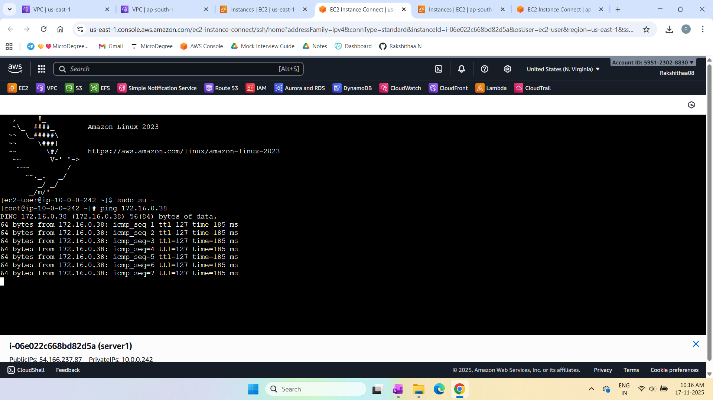
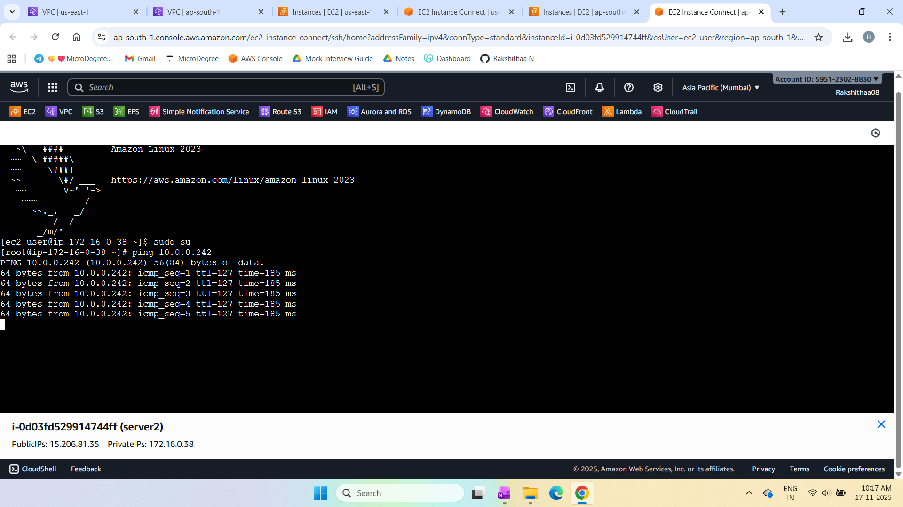

# Hybrid Cloud Integration

This project demonstrates how to connect two AWS VPCs across regions using VPC peering. The setup enables private communication between EC2 instances without exposing traffic to the internet. The guide includes concepts, architecture, deployment steps, and screenshots.

---

## Concepts

### VPC Peering
A private network link between two VPCs that allows resources to communicate using internal IP addresses.

### Key Features
- Works across same or different regions  
- Works across same or different AWS accounts  
- Direct one-to-one VPC connection  
- Traffic stays inside AWS private network  
- Simple routing setup  

### Limitations
- VPC CIDR ranges must not overlap  
- Routing is non-transitive  
- Peering supports only two VPCs per connection  
- DNS resolution must be enabled manually if needed  

---

## Deployment Steps

Full deployment instructions:  
See full deployment instructions [here](docs/deployment-steps.md).

---

## Project Structure
```
hybrid-cloud-integration/
│
├── docs/
│ ├── deployment-steps.md 
│ └── screenshots/
│ ├── server1.png 
│ ├── server2.png 
│ └── architecture.png # Architecture diagram
├── README.md 
└── LICENSE 
```

---

## Architecture Diagram

**Hybrid Cloud Integration – VPC Peering Architecture**  


---

## Screenshots

**Server 1 (N. Virginia)**  


**Server 2 (Mumbai)**  


---

## License

MIT License. See `LICENSE` file for details.

