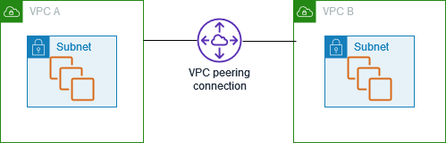
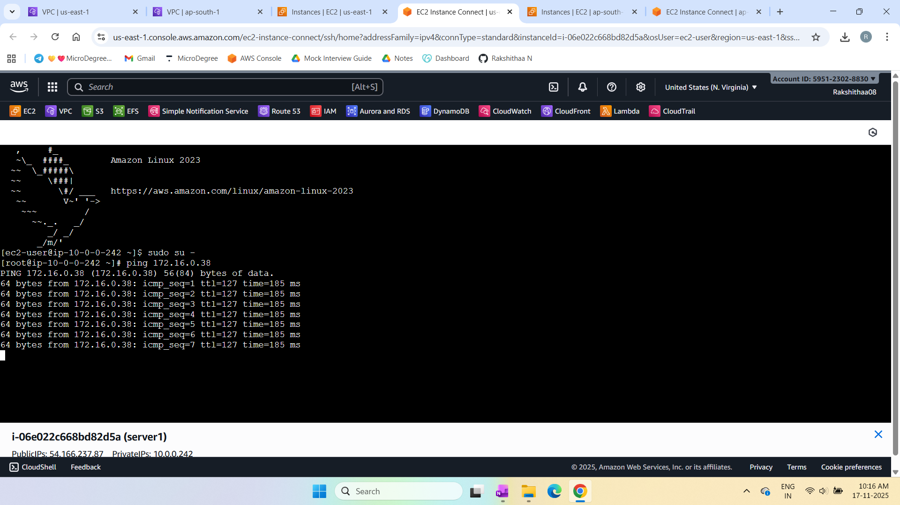
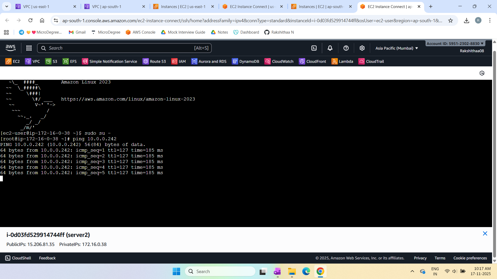

# Hybrid Cloud Integration Using VPC Peering

This project demonstrates how to privately connect EC2 instances across two AWS VPCs in different regions using VPC peering.

---

## Concepts

### VPC Peering
A private network link between two VPCs that allows resources to communicate using internal IP addresses.

### Key Features
- Works across same or different regions
- Works across same or different AWS accounts
- Direct one-to-one VPC connection
- Traffic stays inside AWS private network
- Simple routing setup

### Technologies Used
- AWS VPC (Virtual Private Cloud)
- VPC Peering
- AWS EC2
- AWS Regions (us-east-1 and ap-south-1)
---

## Prerequisites
- AWS account with appropriate IAM permissions
- Two AWS VPCs in different regions with non-overlapping CIDR ranges
- Basic knowledge of AWS VPC and EC2
---

## Deployment Steps

Full deployment instructions:  
See full deployment instructions [here](docs/deployment-steps.md)

---

## Project Structure
```
hybrid-cloud-integration/
│
├── docs/
│   ├── deployment-steps.md
│   └── screenshots/
│       ├── server1.png
│       ├── server2.png
│       └── architecture.png
├── README.md
└── LICENSE 
```

---

## Architecture Diagram


---

## Screenshots

**Server 1 (N. Virginia)**  


**Server 2 (Mumbai)**  


---
## Limitations
- VPC CIDR ranges must not overlap
- Routing is non-transitive — traffic cannot pass through a peered VPC to reach a third VPC
- Peering supports only two VPCs per connection
- DNS resolution must be enabled manually if needed
- Security groups must explicitly allow cross-VPC traffic
- Not suitable for large-scale mesh networking (use AWS Transit Gateway instead)

---
## About This Project
Built to demonstrate cross-region private connectivity between AWS VPCs using VPC peering. This setup simulates a hybrid cloud scenario where resources in different regions communicate securely over AWS private network without using the public internet.

---

## License

MIT License. See `LICENSE` file for details.

